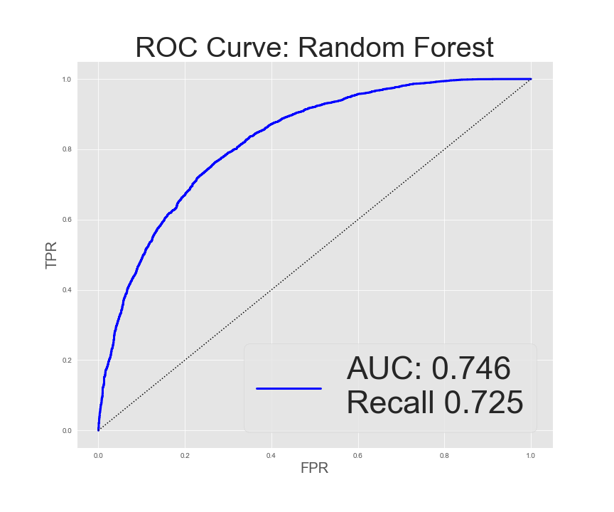
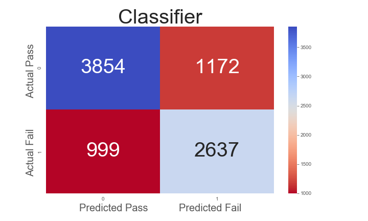
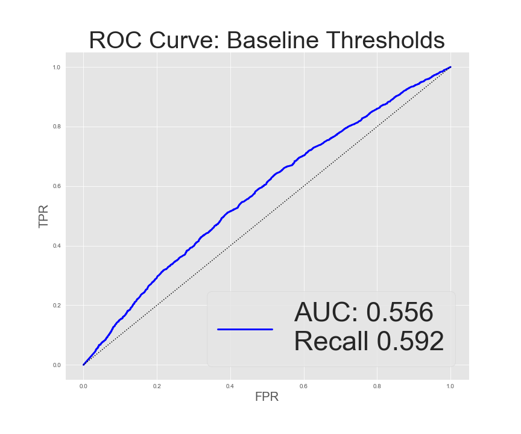
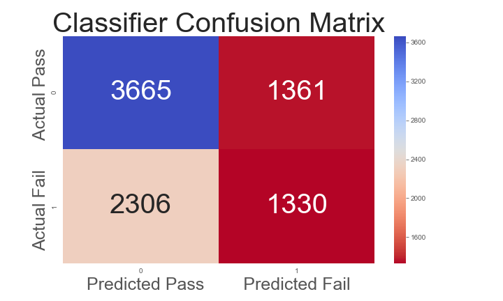
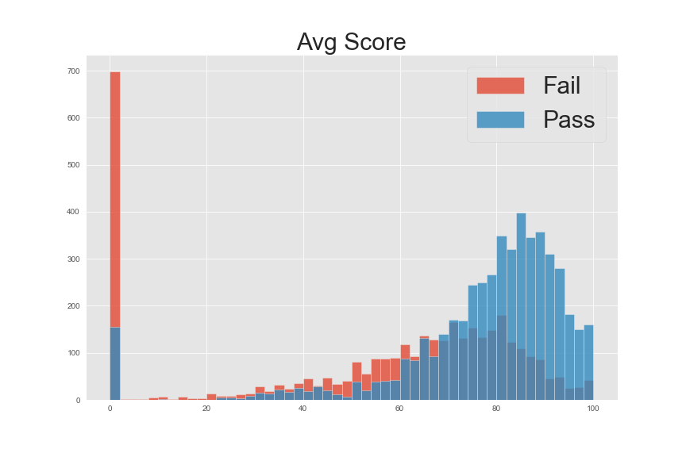
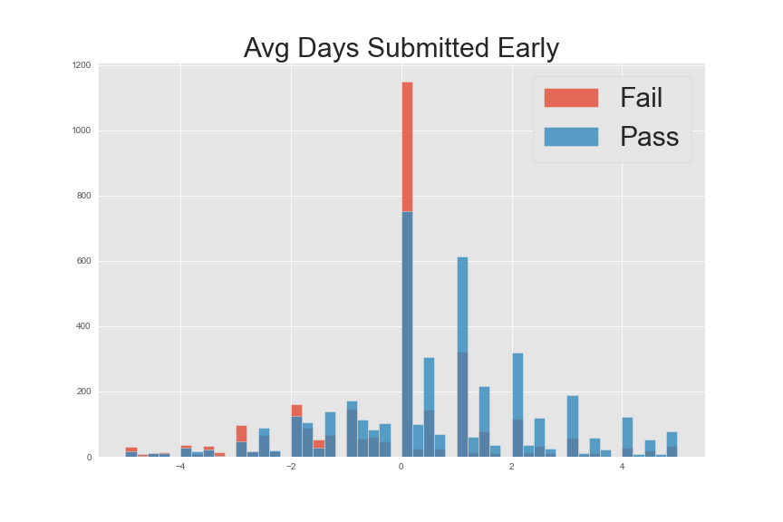
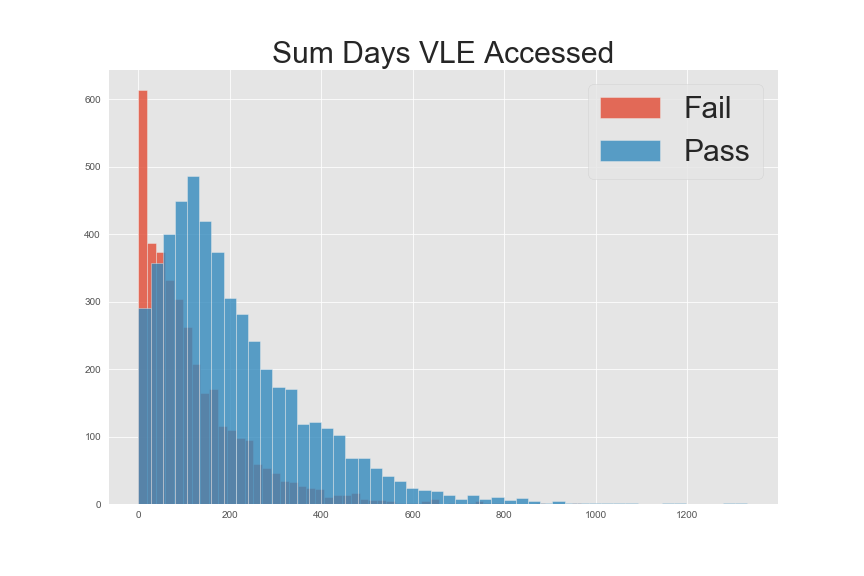

# Predicting Success in Online Education

==============================

## Outline
* Problem Statement
* Results
* Data
* Data Pipeline and Feature Engineering
* Modeling process
* Evaluation
* Next Steps

## Problem Statement

Non-completion rates are higher and more varied for online college courses than for traditional “classroom” courses. Identifying students at risk for failing or dropping is the first step towards interventions which can lead to greater student success.

The goal of this project is to use behavior and demographics to predict if students will successfully complete the course and flag students for intervention.

## Results

A random forest classifier provides a true positive rate of ~0.75. This means that about 75% of the students who will actually fail are predicted to do so by the mdoel. This is significantly better than the baseline true positive rate of ~0.58.

## Data

The data come from the Open University Learning Analytics dataset, which can be found [here](https://analyse.kmi.open.ac.uk/open_dataset). The dataset contains anonynmised data from seven online courses over a two-year period from 2013-2014 with terms starting in either February or October. There are data about courses, students, and students' interactions with the online Viritual Learning Environment.

For purposes of statistical modeling, I split the data into three subdivisions: data from the first 1/4 of the course, data from the first half of the course, and data from the fir st 3/4 of the course.

The data schema is described in this figure:

## Data Pipeline and Feature Engineering
With the goal being able to effectively predict whether a given students would successfully complete a given course, I began by eliminating records for students who were not enrolled on the first day of the course (many students registered for a course, then withdrew before the first day). 

## Modeling process
My primary modeling concerns were evaluating the classifer based in the true positive rate and ROC AUC score. A strong true positive rate directly minimizes false negatives, which in this situation are a "worst case scenario (in my model, "positive" is defined as non-cmpletion). I also sought a model with strong inferenetial characteristics. Knowing why a student is predicted not to complete a course would be be important in designing an intervention. I began by testing numerous classifier types to determine which provided the best out-of-the-box performance. The classifiers tested were:

* Logistic Regression
* Random Forest
* Gradient Boosting
* Support Vector
* K-Nearest Neighbors
* Multi-layer Perceptron

Logistic Regression, Random Forest, and Gradient Boosting performed better initially. I then performed an extensive grid search and model hyperparamnter tuning to get the best performance out of each classifier type. Random Forest and Gradient Boosting performed equally well, with each outperforming Logistic Regression by a siginifcant margin. I chose the Random Forest Classifier as my final model given it's strong performance and relatively high level of interpretability. 

## Evaluation
Models were evaluated prirmarily using the ROC AUC score and the true positive rate (recall). ROC AUC was chosen because ot provides a clear general of sense of how a binary classification perform thoughout the range of prediction thresholds. True prositive rate was chosen because it directly accounts for the proportion of the false negative predictions.  

For the purposes of model evaluation, baseline is determined to be a similar Random Forest Classifier which takes as its features only the information about the students. Hence my final classifier shows how much predicitive power can be obtained by considering students' actions and behaviors. 

Though the strength of the predictions relies on the use of many feautres (as detemined by recursive feature elimination with cross-validation), the following feature were determined to contribute most to predicitions of non-completion:

Feature | Importance
--- | ---
avg_score | 0.0618
avg_days_sub_early | 0.0092
sum_days_vle_accessed | 0.0082
code_module_GGG | 0.0074
sum_click_quiz | 0.0046
sum_click_oucontent | 0.0042
days_early_first_assessment | 0.0034
sum_click_homepage | 0.0030
sum_click_page | 0.0028
code_presentation_2014B | 0.0026

The distributions of the key features split by completion / non-completion support this:

## Next Steps