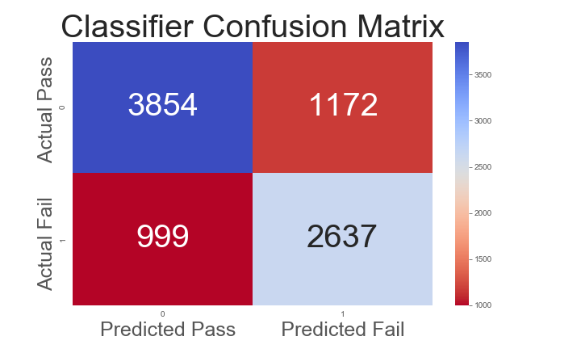

# Predicting Success in Online Education

==============================

## Outline
* Problem Statement
* Results
* Data
* Modeling process
* Evaluation
* Next Steps

## Problem Statement

Non-completion rates are higher and more varied for online college courses than for traditional “classroom” courses. Identifying students at risk for failing or dropping is the first step towards interventions which can lead to greater student success.

The goal of this project is to use behavior and demographics to predict if students will successfully complete the course and flag students for intervention.

## Results

A random forest classifier provides a true positive rate of ~0.75. This means that about 75% of the students who will actually fail are predicted to do so by the mdoel. This is significantly better than the baseline true positive rate of ~0.58.

## Data

The data come from the Open University Learning Analytics dataset, which can be found [here](https://analyse.kmi.open.ac.uk/open_dataset). The dataset contains anonynmised data from seven online courses over a two-year period from 2013-2014 with terms starting in either February or October. There are data about courses, students, and students' interactions with the online Viritual Learning Environment.

For purposes of statistical modeling, I split the data into three subdivisions: data from the first 1/4 of the course, data from the first half of the course, and data from the fir st 3/4 of the course.

The data schema is described in this figure:

## Modeling process
With the goal being able to effectively predict whether a given students would successfully complete a given course, I began by eliminating records for students who were not enrolled on the first day of the course (many students registered for a course, then withdrew before the first day). I began by testing numerous classifier types to determine which provided the best out-of-the-box performance. THe classifiers tested were:
* Logistic Regression
* Random Forest
* Gradient Boosting
* Support Vector
* K-Nearest Neighbors
* Multi-layer Perceptron

## Evaluation
Models were evaluated prirmarily using the ROC AUC score and the true positive rate (recall). ROC AUC was chosen because ot provides a clear general of sense of how a binary classification perform thoughout the range of prediction thresholds. True prositive rate was chosen because it directly accounts for the proportion of the false negative predictions.  

plots

Though the strength of the predictions relies on the use of many feautres, the following feature were determined to contribute most to predicitions of non-completion:

## Next Steps