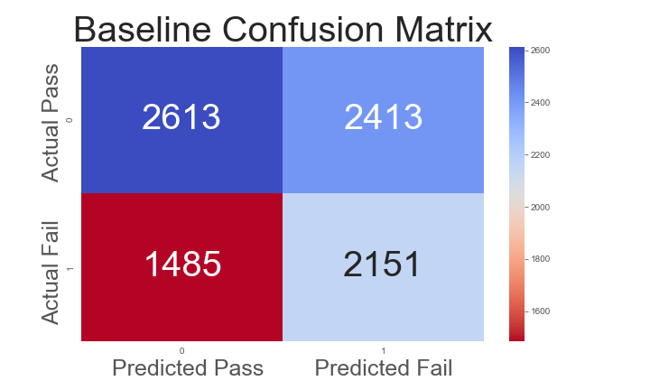

# Predicting Success in Online Education

==============================

## Outline
* Problem Statement
* Results
* Data
* Data Pipeline and Feature Engineering
* Modeling process
* Evaluation
* Next Steps

## Problem Statement

Non-completion rates are higher and more varied for online college courses than for traditional “classroom” courses. Identifying students at risk for failing or dropping is the first step towards interventions which can lead to greater student success.

The goal of this project is to use behavior and demographics to predict whether students will successfully complete the course and to flag students for intervention.

## Results

After splitting the data based on time and using the first 1/4 of the course time, a random forest classifier provides a true positive rate of ~0.75. This means that about 75% of the students who will actually fail are predicted to do so by the model. This is significantly better than the baseline true positive rate of ~0.58.

## Data

The data come from the Open University Learning Analytics dataset, which can be found [here](https://analyse.kmi.open.ac.uk/open_dataset). The dataset contains anonymized data from seven online courses over a two-year period from 2013-2014 with terms starting in either February or October. There are data about courses, students, and students' interactions with the online Viritual Learning Environment.

The data schema is described in this figure:

## Data Pipeline and Feature Engineering
With the goal being able to effectively predict whether a given student would successfully complete a given course, I split the data into three subdivisions: data from the first 1/4 of the course, data from the first half of the course, and data from the first 3/4 of the course. I also eliminated records for students who were not enrolled on the first day of the course (many students registered for a course, then withdrew before the first day). I then estimated the student's final score (it was not provided in the data) by taking the weighted sum of assessments (weights were provided). After realizing that some of the estimated final scores ranged up to 200, I determined which courses were "double-modules" and halved those students' estimated final scores. (A double-module is worth twice the credit of a single course and scored on a scale of 200.) I then joined and aggregated the data to create the following features:

* Demographics and Student Information
    * gender 
    * region 
    * highest_education 
    * imd_band 
    * age_band 
    * num_of_prev_attempts 
    * studied_credits 
    * disability 

* Course Information
    * date_registration 
    * date_unregistration 
    * module_presentation_length 

* Student Actions
    * sum_days_vle_accessed 
    * max_clicks_one_day 
    * first_date_vle_accessed 
    * estimated_final_score 
    * avg_score 
    * avg_days_sub_early 
    * days_early_first_assessment 
    * score_first_assessment
    * sum_click_dataplus 
    * sum_click_dualpane 
    * sum_click_externalquiz 
    * sum_click_folder 
    * sum_click_forumng 
    * sum_click_glossary 
    * sum_click_homepage 
    * sum_click_htmlactivity 
    * sum_click_oucollaborate 
    * sum_click_oucontent 
    * sum_click_ouelluminate 
    * sum_click_ouwiki 
    * sum_click_page 
    * sum_click_questionnaire 
    * sum_click_quiz 
    * sum_click_repeatactivity 
    * sum_click_resource 
    * sum_click_sharedsubpage 
    * sum_click_subpage 
    * sum_click_url 

The target for my model was:
* module_not_completed

## Modeling process
My primary modeling concerns were evaluating the classifer based on the true positive rate (recall) and ROC AUC score. A strong true positive rate directly minimizes false negatives, which in this situation are a "worst case scenario" (in my model, "positive" is defined as non-completion). ROC AUC was chosen because it provides a clear general sense of how a binary classifier performs thoughout the range of prediction thresholds. I also sought a model with strong inferential characteristics. Knowing why a student is predicted not to complete a course would be important in designing an intervention. I began by testing numerous classifier types to determine which provided the best out-of-the-box performance. The classifiers tested were:

* Logistic Regression
* Random Forest
* Gradient Boosting
* Support Vector
* K-Nearest Neighbors
* Multi-layer Perceptron

Logistic Regression, Random Forest, and Gradient Boosting performed better initially. I then performed an extensive grid search and model hyperparameter tuning to get the best performance out of each classifier type. Random Forest and Gradient Boosting performed equally well, with each outperforming Logistic Regression by a significant margin. I chose the Random Forest Classifier as my final model given its strong performance and relatively high level of interpretability. 

## Evaluation
The final classifier was evaluated using the ROC AUC score and the true positive rate described above and by comparing the model to a relevant baseline. For the purpose of model evaluation, baseline was determined to be a similar Random Forest Classifier which takes as its features only the information about the students. Hence my final classifier shows how much predictive power can be obtained by considering students' actions and behaviors. 

After evaluating classifier performance using my three sets of data (1/4,1/2, or 3/4 of the course completed as measured in days since the course opened), I determined that model performance increased only a small amout as more data were used. Since the potential benefits of intervening earlier are likely higher, I decided to use only the first 1/4 of the data for my final classifier.

Though the strength of the predictions relies on the use of many features (as detemined by recursive feature elimination with cross-validation), the following features were determined to contribute most to predictions of non-completion:

Feature | Importance
--- | ---
avg_score | 0.0618
avg_days_sub_early | 0.0092
sum_days_vle_accessed | 0.0082
code_module_GGG | 0.0074
sum_click_quiz | 0.0046
sum_click_oucontent | 0.0042
days_early_first_assessment | 0.0034
sum_click_homepage | 0.0030
sum_click_page | 0.0028
code_presentation_2014B | 0.0026

The distributions of the key features split by completion / non-completion support this:

## Next Steps

An important next step in this process would be to consult the relevant literature about the efficacy of various types of interventions and perform a study attempting to assess which interventions are most effective in improving course completion rates. 

It would also be valuable to obtain similar data from other institutions and updated data from the Open University to learn how completion rates and their factors may vary across time and institution.